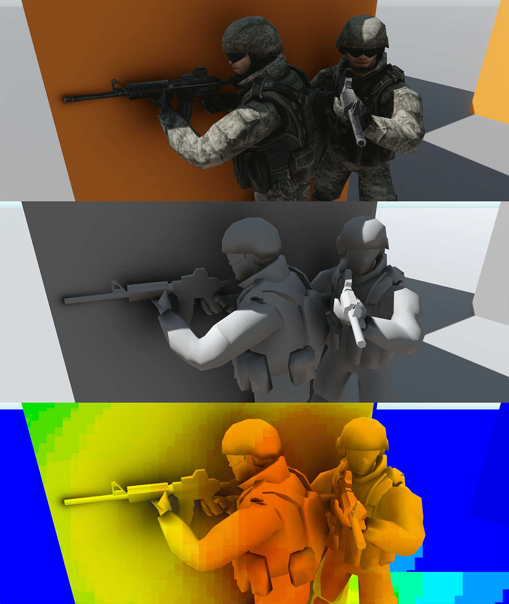

# Capsule Occlusion



# What is this?
A Unity package implementing capsule/character occlusion as seen in The Last Of Us[^1], Shadow Warrior 2[^2] and others. It is mainly intended to be used in forward rendering pipelines with MSAA (where SSAO is not viable).

Unlike other implementations I've seen, this one supports fairly robust self-occlusion based on the normal direction, which means you can evaluate it for the caster mesh as well.

To speed up rendering, capsules are gathered in clusters (implemented as a linked list on the GPU) which are used to limit per-pixel occlusion evaluation.

Clustering can be performed using either a naive compute shader or a single rasterization pass (which is the faster and preferred method).

# How do I use it?
1. Add the package to your project either using the Package Manager (Add package from GIT url...) or by manually placing it in your project's Packages folder (embedded package).
2. In your scene or prefab, add one or more ```OcclusionCapsule``` components.
3. Add a ```CapsuleOcclusionCamera``` component to your camera.
4. In your shader, add ```#include "Packages/dev.fewes.capsuleocclusion/Shaders/CapsuleOcclusion.hlsl"```
5. In your shader, evaluate occlusion using the function ```GetCapsuleOcclusion(worldPos, worldNormal, screenUV, linear01Depth);```

# Requirements
* Compute shaders
* Shader model 4.5 (only required for rasterization path)

# Areas of improvement
* Cone shadows could be implemented fairly easily. I chose not to do this because overdraw ends up being a limiting factor and running it in full resolution with MSAA might be unrealistic. It also increases the number of parameters and a cone direction must be selected somehow.
* The linked list used for the clusters must have a max size (set by the ```Cluster Data Headroom``` parameter). If the number of cluster hits exceeds the list capacity, rendering bugs occur. It would be possible to detect when or just before this happens using async readback operations and dynamically expand the list.
* Currently, the capsules are culled and sorted per-camera on the main thread. The code has been optimized a fair bit but still, it would be preferable to do this in a job or similar.
* The cluster data is stored in an unsorted linked list, which likely results in poor cache performance. Bitonic sorting or similar could be used to improve this but was not implemented due to its high complexity.

# Acknowledgements
Capsule intersection and occlusion approximation functions by Inigo Quilez:
* https://iquilezles.org/articles/intersectors/
* https://www.shadertoy.com/view/llGyzG

Capsule-capsule collision function (used for compute clustering) by Noah Zuo:
* https://arrowinmyknee.com/2021/03/15/some-math-about-capsule-collision/

Low Poly Soldiers Demo used for screenshot by Polygon Blacksmith:
* https://assetstore.unity.com/packages/3d/characters/low-poly-soldiers-demo-73611

[^1]: Lighting Technology of "The Last Of Us" - http://miciwan.com/SIGGRAPH2013/Lighting%20Technology%20of%20The%20Last%20Of%20Us.pdf
[^2]: Rendering of Shadow Warrior 2 - https://knarkowicz.files.wordpress.com/2017/05/knarkowicz_rendering_sw2_dd_20171.pdf
